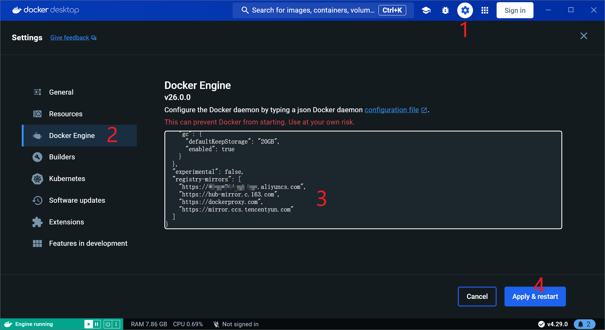

# 更新docker镜像源

信息源:

1. [2024 年 4 月可以用的 docker 国内源](https://zhuanlan.zhihu.com/p/690195557)

---

因为DockerHub的服务器在国外，导致下载镜像很慢。  
这里介绍更换Docker镜像的方法。

## Windows(Docker Desktop)

1. 请根据下图打开设置后，  
将镜像设置添加或替换到设置中,  
最后点击【Apply & restart】用于应用新设置。  
**注意:** 如果设置内容前有其它json要素，请在添加前追加逗号【,】以保持json格式完整。不然，会报错。)

    1. 设置画面
      
      上图中打马赛克的地方是我自己的阿里云镜像地址。
    2. 追加设置内容:  
      之所以会添加多个镜像是因为，某天某个镜像挂了，也可以保证其他镜像可用。

        ```json
        "registry-mirrors": [
          "https://hub-mirror.c.163.com",
          "https://dockerproxy.com",
          "https://dockerhub.azk8s.cn",
          "https://mirror.ccs.tencentyun.com"
        ]
        ```

1. 尝试用新镜像设置
   1. 用`docker images | grep "ubuntu"`来确认本地是否已有ubuntu镜像。
   2. 如果存在，请用`docker rmi -f ubuntu`命令，删除该镜像。(最好再用images命令确认已删除)
   3. 用`docker pull ubuntu`命令下载镜像。

## Linux(Docker Engine)

信息源:

* [Configure the Docker daemon](https://docs.docker.com/docker-hub/mirror/#configure-the-docker-daemon)
* [Flush changes and restart Docker](https://docs.docker.com/config/daemon/systemd/#httphttps-proxy:~:text=Flush%20changes%20and%20restart%20Docker)

以下内容未经验证。daemon.json的设置内容同Windows。

> Linux命令行下，设置文件地址为`/etc/docker/daemon.json`  
> sudo systemctl reload dockerd  
> sudo systemctl restart docker
